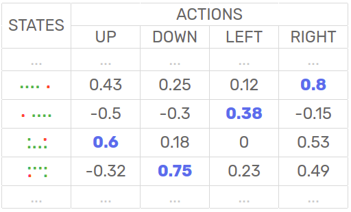
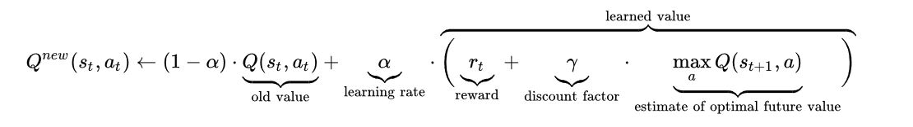
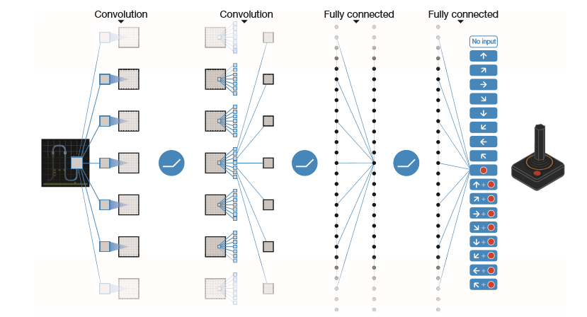

### Learning Algorithm and implementation details:

In this project, a reinforcement learning agent is trained using **Deep Q-Learning with Experience Replay and Fixed Q-Targets** in a Unity Banana Collector Environment to navigate a square world collecting yellow bananas and avoiding blue bananas.  

First,let's discuss the basic Q-Learning algorithm:  
#### Q-Learning:
The goal of Q-learning is to provide the agent with the capability of learning to act optimally in Markovian domains by experiencing the consequences of actions.

It finds a policy that maximizes the expected value of the total reward over any and all successive steps, starting from the current state.   

The algorithm has a function that calculates the quality of each state-action combination Q(st,at) 

The shown Q-table is initialized with zeros. Then, at each time step t, the agent selects an action at
, evaluates its consequences in terms of the immediate reward or penalty rt it receives, enters a new state st+1 (that depends on both the previous state st and the selected action), and updates Q(st,at) as follows:

By trying all actions in all states repeatedly, it learns which state-action pairs are best overall, judged by long-term discounted reward.

#### Deep Q-Learning:

In Deep Q-Learning The Q function is represented by a deep neural net instead of a table.
The network takes the current state as an input and outputs a probability distribution of the likelihood of each action being the best action to take.    
So, basicly, the input size of the net is the **state size(dimensionality)**  while its output size is the **number of possible actions** the agent can take.

#### Experience Replay:
 